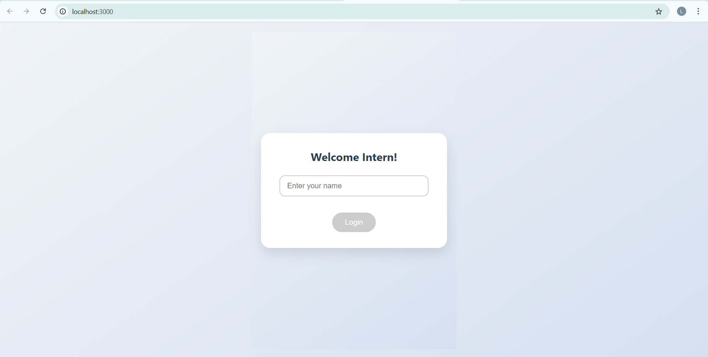
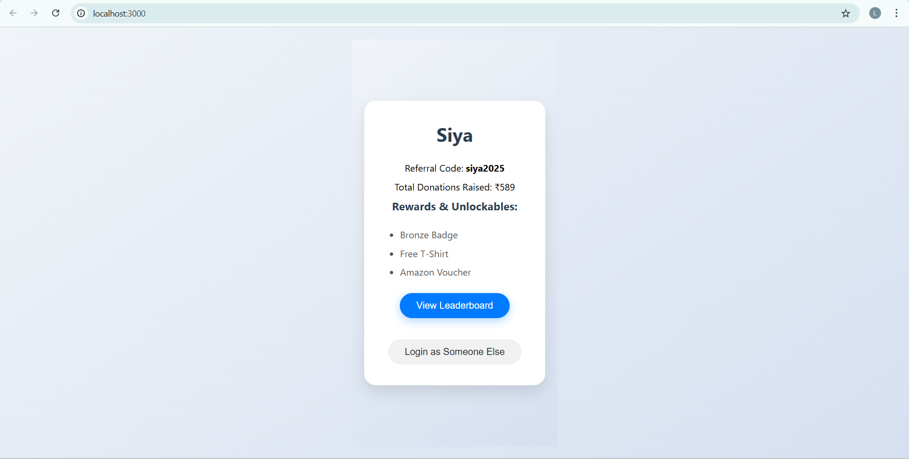

# 🌐 **Intern Dashboard Portal** (Dummy Full Stack App)

A simple full-stack intern dashboard using **React** and **Node.js + Express**.  
This app uses **localStorage** for login and shows dummy backend data for leaderboard, referral code, donations, and rewards.

---

## 🚀 **Features**

### 👨‍💻 **Frontend (React)**

- **Name-based login** (no password or auth)
- Saves user in `localStorage`
- Personalized dashboard with:
  - Intern name
  - Referral code (`yourname2025`)
  - Total donations (dummy)
  - Rewards (static list)
- Leaderboard (static data from backend)
- Refresh clears login (redirects to login page)
- Duplicate name detection (shows dashboard but doesn’t re-add to leaderboard)

### ⚙️ **Backend (Node.js + Express)**

- Simple Express server with two dummy API routes:
  - `/api/user` → returns static user data
  - `/api/leaderboard` → returns hardcoded leaderboard data

❗ No database is used — all data is static.

---


---

## 🔧 **Setup Instructions**

### 📦 1. Backend Setup (Node.js API)

```bash
# Go to the backend directory
cd backend

# Install dependencies
npm install express cors

# Start the backend server
node server.js

```
### 🖥️ 2. Frontend Setup (React Application)

```bash

# Go to the frontend directory
cd frontend

# Install React dependencies
npm install

# Start the React development server
npm start

```

## 🖼️ Preview

Here is a preview of the Intern Dashboard:






